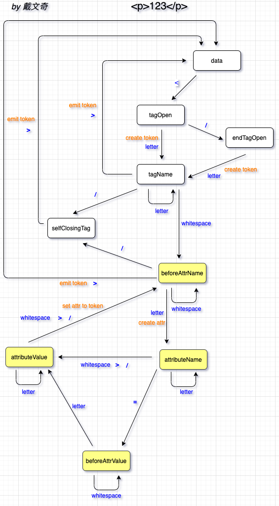

# toy-html-parser

魔改 html parser 的一个项目，完成了组内的分享。在研究过程中对浏览器解析 html 的实现有了深入了解，收获颇多，渲染的类 html 文本如下：

```html
  <m01>
  <arg>我们预计将于 UTC \${local_time;202104060200}进行为期4个小时的停服更新维护。维护期间将无法登陆游戏，给您带来的不便我们深感歉意。 </arg>
  </m01>
```

```html
  <m01>
    <arg>
      <url|value=https://www.facebook.com/playwarpath/>
        <style|value=green_30>
        <u>Join us on Facebook</u>
      </url>
      <arg>魔法少女12345</arg>
    </arg>
  </m01>
```

```html
  <m01>
    <arg>您的部队首……黑鸦军团了。</arg>
    <arg>\${center}</arg>
  </m01>
```


